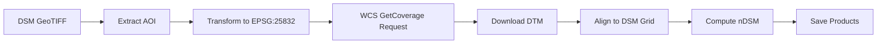

# nDSM Generator (Bavaria DGM1)

Generate **normalized Digital Surface Models (nDSM)** by automatically downloading Bavaria's **DGM1 (Digital Terrain Model)** via INSPIRE **WCS 2.0.1** and computing the difference between your DSM and the DTM.

**nDSM = DSM − DTM** gives you the height of objects (buildings, vegetation, etc.) above ground level.

---

## Features

- Automatic DTM download from Bavaria's INSPIRE WCS service (DGM1, 1m resolution)
- CRS-aware processing — works with DSMs in any coordinate system
- Precise grid alignment — DTM is resampled to match your DSM's exact pixel grid
- Batch processing — process multiple DSM files in one go
- Secure credential handling via environment variables
- Flexible resampling — choose between nearest, bilinear, or cubic resampling
- Optimized output — compressed GeoTIFF files with proper nodata handling

---

## Repository Structure

```
18_nDSM_generator/
├── ndsm_generator.ipynb          # Single DSM processing
├── ndsm_generator_batch.ipynb    # Batch processing for multiple DSMs
├── modules/
│   └── ndsm_tools.py             # Core processing functions
├── requirements.txt              # Python dependencies
├── .gitignore
└── README.md
```

---

## Installation

### Prerequisites

- Python 3.8+
- Valid credentials for Bavaria's geodata service (LDBV)

### Setup

1. Clone the repository:
3. Set up credentials in your conda environment (recommended):
   ```bash
   conda activate your_env
   conda env config vars set LDBV_USER="your_username" LDBV_PASS="your_password"
   conda deactivate && conda activate your_env
   ```

   Alternatively, the notebooks will prompt for credentials if environment variables are not set.

---

``bash
conda activate your_env
conda env config vars set LDBV_USER="your_username" LDBV_PASS="your_password"
conda deactivate && conda activate your_env
```

**Option 2: Manual Entry**

The notebooks will prompt for credentials if environment variables are not set.

### Usage

#### Single DSM Processing

1. Open `ndsm_generator.ipynb`
2. Set your input DSM path and output paths
3. Run all cells

#### Batch Processing

1. Open `ndsm_generator_batch.ipynb`
2. Configure:
    `DSM_FOLDER` — folder containing DSM files
   - `OUTPUT_FOLDER` — where to save nDSM (CHM) files
   - `DTM_OUTPUT_FOLDER` — where to save DTM files
   - `DSM_PATTERN` — file pattern (e.g., `"*_DSM.tif"`)
3. Run all cells

---

## Output Products

For each DSM, the pipeline generates:

1. **`*_DTM.tif`** — Raw DTM downloaded from WCS
2. **`*_DTM_aligned_to_DSM.tif`** — DTM resampled to exact DSM grid
3. **`*_CHM.tif`** or **`*_nDSM.tif`** — Height above ground (DSM − aligned DTM)

---

## How It Works



1. **Extract AOI**: Read DSM extent and transform to EPSG:25832 (required by WCS)
2. **Apply Buffer**: Add small buffer (0-2m) to avoid edge artifacts
3. **WCS Request**: Download DGM1 coverage for the AOI
4. **Grid Alignment**: Resample DTM to match DSM's CRS, transform, and dimensions exactly
5. **Compute nDSM**: Subtract aligned DTM from DSM with proper nodata handling
6. **Save Results**: Write compressed GeoTIFF files

---

## Configuration Options

| Parameter | Description | Default |
|-----------|-------------|---------|
| `BUFFER_M` | Edge buffer in meters | `2.0` |
| `PIXEL_M` | Requested WCS pixel spacing | `1.0` |
| `RESAMPLING` | Resampling method | `"bilinear"` |
| `GENERATE_NDSM` | Create nDSM files (batch mode) | `True` |

### Resampling Methods

- **`bilinear`** — Recommended for most cases; smooth results
- **`cubic`** — Highest quality; slightly slower
- **`nearest`** — Preserves original values; best for categorical data

---

## Data Source & License

**DTM Source**: DGM1 — *Bayerische Vermessungsverwaltung* (LDBV)  
**License**: [CC BY 4.0](https://creativecommons.org/licenses/by/4.0/)  
**Service**: INSPIRE WCS 2.0.1

**Attribution Required**: Please cite the data source in any publications or products:
> *"Digitales Geländemodell - Bayerische Vermessungsverwaltung (www.geodaten.bayern.de), CC BY 4.0"*

---

## Credentials

Access to Bavaria's WCS service requires authentication. To obtain credentials:

1. Register at [geodaten.bayern.de](https://geodaten.bayern.de/)
2. Subscribe to the INSPIRE elevation service
3. Use your credentials with this tool

---

## Troubleshooting

### WCS Download Fails

- **Check credentials**: Ensure `LDBV_USER` and `LDBV_PASS` are correct
- **Verify AOI**: Ensure your DSM covers an area within Bavaria
- **Check CRS**: Input DSM should have proper CRS metadata

### Alignment Issues

- **Increase buffer**: Try `BUFFER_M = 5.0` for better edge coverage
- **Check nodata values**: Ensure DSM has proper nodata metadata

### Memory Issues (Batch Processing)

- Process fewer files at once
- Use smaller `BUFFER_M` to reduce DTM coverage area

---

## Contributing

Contributions are welcome! Feel free to:
- Report bugs or issues
- Suggest new features
- Submit pull requests

---

## License

This code is provided as-is for processing elevation data. Please respect the data license (CC BY 4.0) when using DGM1 products.

---

## Contact

For questions about Bavaria's geodata services, visit [geodaten.bayern.de](https://geodaten.bayern.de/)
